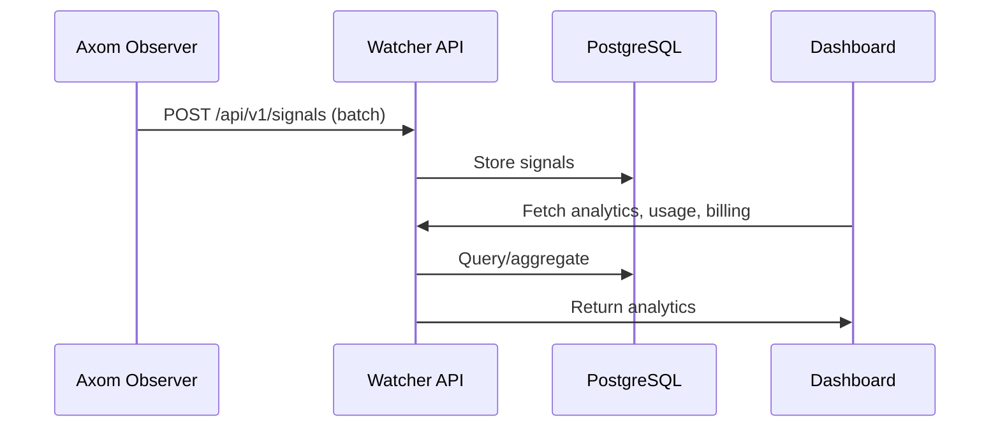

# Axom-Portal
# Watcher

A production-grade, multi-tenant analytics and billing portal for AI agent owners, powered by Axom Observer.

---

## Architecture

```mermaid
flowchart TD
    subgraph Customer
      U[User/Owner] 
    end
    U--Login/API-->F[React Frontend]
    F--REST/GraphQL-->B[Go Backend API]
    B--SQL-->D[(PostgreSQL)]
    B--Signals-->E[Elasticsearch (optional)]
    B--Metrics-->G[Grafana/Prometheus]
    B--Docker Compose-->All
```

---

## Signal Flow



---

## Features

- Multi-tenant: customers, agents, users
- Secure login, API key management
- Signal ingestion API
- Analytics dashboard (usage, outcome, billing)
- Dockerized (backend, frontend, DB)
- Production-ready structure

---

## Getting Started

1. `docker-compose up --build`
2. Access frontend at [localhost:3000](http://localhost:3000)
3. Backend API at [localhost:8080](http://localhost:8080)

---

## Extending

- Add authentication, user/agent CRUD, billing logic, and Grafana dashboards as needed.

---
