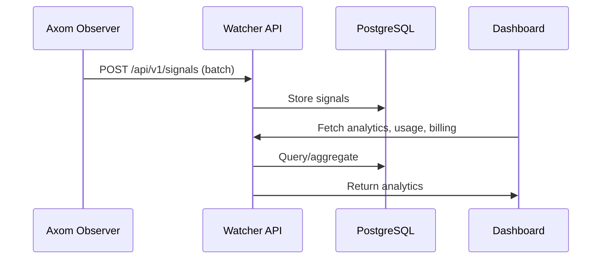

# Axom-Portal
# Watcher

A production-grade, multi-tenant analytics and billing portal for AI agent owners, powered by Axom Observer.

---

## Architecture

```mermaid
flowchart TD
    subgraph Customer
      U[User/Owner] 
    end
    U--Login/API-->F[React Frontend]
    F--REST/GraphQL-->B[Go Backend API]
    B--SQL-->D[(PostgreSQL)]
    B--Signals-->E[Elasticsearch (optional)]
    B--Metrics-->G[Grafana/Prometheus]
    B--Docker Compose-->All
```

---

## Signal Flow



---

## Features

- Multi-tenant: customers, agents, users
- Secure login, API key management
- Signal ingestion API
- Analytics dashboard (usage, outcome, billing)
- Dockerized (backend, frontend, DB)
- Production-ready structure
- Cleaned up unused files (e.g., removed legacy routes.tsx; frontend uses app-router.tsx for routing)

---

## Getting Started

1. `docker-compose up --build`
2. Access frontend at [localhost:3000](http://localhost:3000)
3. Backend API at [localhost:8080](http://localhost:8080)

---

## Extending

- Add authentication, user/agent CRUD, billing logic, and Grafana dashboards as needed.

---

# Portal

A web-based management interface for monitoring and managing AI agents.

## Prerequisites

- Docker and Docker Compose
- Node.js (for local development)
- PostgreSQL (if running database locally)

## Quick Start

1. Clone the repository:
```bash
git clone https://github.com/your-org/portal.git
cd portal
```

2. Start the services:
```bash
docker-compose up -d
```

This will start:
- Frontend (http://localhost:3000)
- Backend (http://localhost:8080)
- PostgreSQL Database
- pgAdmin (http://localhost:5050)
- Database Migrations

## Initial Setup

### Database Access

The default database credentials are:
- Database: portal
- Username: user
- Password: password
- Port: 5432

### pgAdmin Setup

1. Access pgAdmin at http://localhost:5050
2. Login with:
   - Email: admin@admin.com
   - Password: admin
3. Add a new server:
   - Name: Portal DB
   - Host: db
   - Port: 5432
   - Database: portal
   - Username: user
   - Password: password

### Initial Data Setup

If you need to initialize the database with a default company and admin user, run:

```bash
# Create init.sql file with the following content:
cat > init.sql << 'EOL'
-- Create a company
INSERT INTO companies (id, name, created_at)
VALUES (
    'd0dfd7ae-50a9-47f5-b799-41b6f7b2a387',
    'Default Company',
    NOW()
);

-- Create an admin user (password: admin123)
INSERT INTO users (id, company_id, email, password_hash, role, created_at)
VALUES (
    'c413b198-b684-4c40-b055-18bed64470d1',
    'd0dfd7ae-50a9-47f5-b799-41b6f7b2a387',
    'jha.vishesh@gmail.com',
    '$2a$10$N9qo8uLOickgx2ZMRZoMyeIjZAgcfl7p92ldGxad68LJZdL17lhWy',
    'admin',
    NOW()
);
EOL

# Run the initialization script
docker-compose exec db psql -U user -d portal -f /init.sql
```

## Usage

### Login

1. Access the portal at http://localhost:3000
2. Login with:
   - Email: jha.vishesh@gmail.com
   - Password: admin123

### Managing Agents

1. **Create an Agent**:
   - Click "Add Agent" on the Agents page
   - Enter a name for your agent
   - The system will generate credentials automatically

2. **API Keys**:
   - Click "Show API Keys" for any agent
   - Click "Create API Key" to generate a new key
   - Use this key to configure the Observer

3. **Observer Configuration**:
   - Download the Observer from [GitHub](https://github.com/axom-ai/observer)
   - Configure with:
     ```env
     AGENT_ID=your-agent-id
     API_KEY=your-api-key
     ```
   - Deploy alongside your AI agent

### Monitoring

- View agent signals and metrics in the dashboard
- Monitor API usage and performance
- Set up alerts for specific conditions

## Development

### Local Development

1. **Frontend**:
```bash
cd frontend
npm install
npm start
```

2. **Backend**:
```bash
go mod download
go run cmd/server/main.go
```

### Database Migrations

Migrations are automatically applied when the services start. To manually run migrations:

```bash
docker-compose run migrate
```

## Troubleshooting

### Common Issues

1. **Can't Login**:
   - Ensure the database is initialized with the default user
   - Check if the backend service is running
   - Verify the database connection

2. **API Keys Not Working**:
   - Check if the agent exists
   - Verify the API key is active
   - Ensure the Observer is configured correctly

3. **Database Connection Issues**:
   - Check if PostgreSQL is running
   - Verify the credentials in docker-compose.yml
   - Check the database logs

### Reset Everything

If you need to start fresh:

```bash
# Stop all services and remove volumes
docker-compose down -v

# Start fresh
docker-compose up -d
```

## Support

For support, please:
1. Check the [documentation](https://docs.watcher.ai)
2. Open an issue on GitHub
3. Contact support@watcher.ai

## License

[Your License Here]

---
